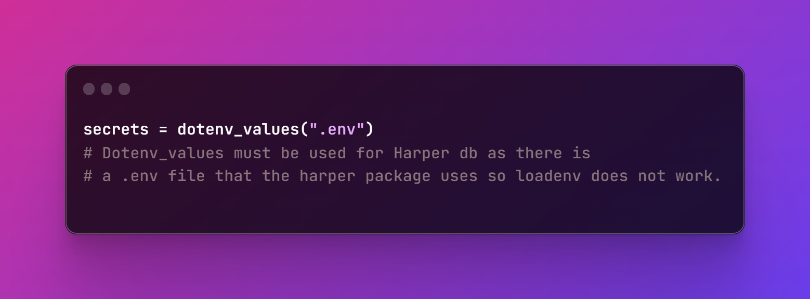
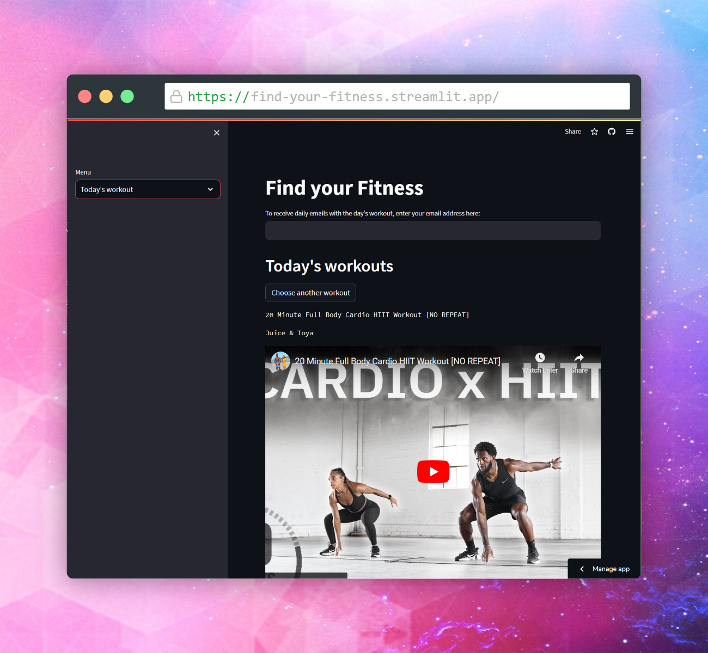

# Find Your Fitness

-------

## About the project

### Inspiration
Inspiration take from Patrick Loeber's wonderful tutorial, creating a very similar fitness app. You can find that 
tutorial here: https://youtu.be/KMkmA4i2FQc

### What it does

You can collect your favourite workout videos, ina curated database for the user. View all the videos or have a random video each day in the app. If you enter your email address you can also have an email sent daily to your inbox with a link to the day's workout.

### How I built it

I started out by building out the connection to the HarperDB database in the database.py file. Here I created the functions 
that would be needed for the app to interact with the database. 

Next up was collecting data about a YouTube video based on the URL provided by the user. Initially I started with the youtube_dl module,
as is specified in Patrick's video, however I was unable to get that module to work, coming across many issues, so I pivoted to start 
to learn about the YouTube Data API. I used this API to create a function that would pull the video id from the short form youtube share link
 and use this to pull data from the API such as channel name, view count amongst others, all of which is collected in the database.

The next piece was to build the Streamlit app. This mainly centered around the implementing the database functions in the app
the navigation made in the app lead to the appropriate changes in the backend.

The final stage was to set up the ability to send out emails. Initially I had planned to continue following the tutorial,
however having no javascript experience, I struggled with getting the local Harper DB instance working, so I pivoted to finding
a python based solution, so with the help of [Coding is Fun's tutorial](https://youtu.be/OLrC4J2-pvk) on automating emails I figured that out too.
Instead of using Deta as Coding is fun did, I scheduled the emails using cronjobs from my personal server. You can see the code for the emailing functionality [here](https://github.com/ShaniceWilliams/FYF-email-scheduling).

### Challenges I ran into

There were some particular challenges with handling sensitive data such as database connection information.
In the past I have only had experience with using loadenv from the python-dotenv package, however when using this I could 
not access the database instance I had created. After doing some research I found that the reason was related to a .env within
the HarperDB package, and so I found the below solution.

### What's next for Find Your Fitness
I think the next iteration would be to try to implement this in Flask rather than using Streamlit, as this would offer more
UI flexibility, and using Flask is a skill I am looking to improve.

I would also like to add more error handling and logging for troubleshooting purposes.

------

## Built with

Python, Streamlit, HarperDB, and the YouTube Data API

----

## Try it out

You can try it out for yourself here: https://ghw-fitness-app.streamlit.app/

-----
### Resources

- Patrick Loeber's Fitness App video: https://youtu.be/KMkmA4i2FQc
- Coding is fun's automation video: https://youtu.be/OLrC4J2-pvk
- HarperDB Documentation: https://docs.harperdb.io/docs/
- YouTube Data API Documentation: https://developers.google.com/youtube/v3/docs
